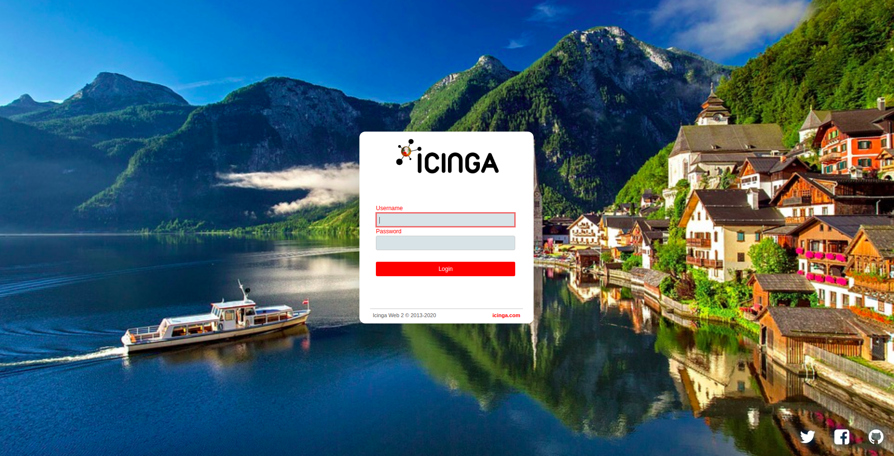
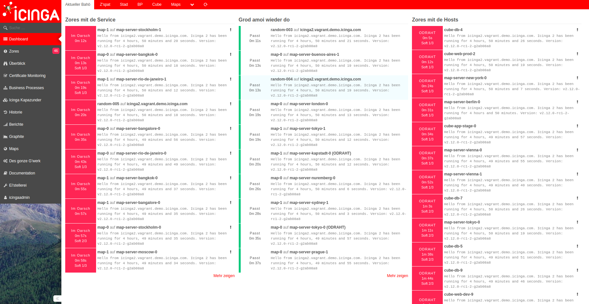

Oesterreichisch Theme for Icinga Web 2
=================================

<!-- TOC -->

- [Features](#features)
  - [Custom theme](#custom-theme)
  - [Custom language](#custom-language)
- [How to install](#how-to-install)

<!-- /TOC -->

## Features

### Custom theme

* Main logo in the interface replaced by a austrian Icinga Logo
* Colors of Icinga tuned for a austria look
* Login background changed
* Background to menu added

### Custom language

 * This theme brings its own language which you can choose in your settings (de_AT)

## How to install

Install these theme repository like any other Icinga Web 2 module at:

    /usr/share/icingaweb2/modules/oesterreichisch

    
After installing the module you have to execcute the following installation script.

    /usr/share/icingaweb2/modules/oesterreichisch/installation/installation.sh

If the module is not already enabled, enable the module:

    icingacli module enable oesterreichisch

Then you can select the theme and/or language in the admin or user UI.
